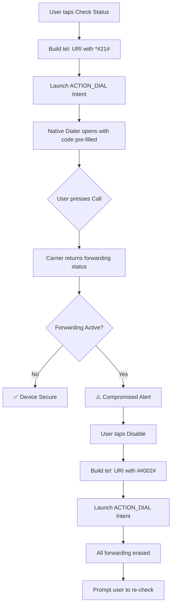

# Android Permissions & USSD Logic — Privacy Activater

## Required Android Permissions

| Permission | Purpose | Risk Level |
|---|---|---|
| `READ_SMS` | Read incoming SMS for categorization & phishing detection | Dangerous |
| `RECEIVE_SMS` | Real-time interception of new SMS via BroadcastReceiver | Dangerous |
| `CALL_PHONE` | Execute USSD codes via dialer intent | Dangerous |
| `READ_PHONE_STATE` | Detect call forwarding status programmatically | Dangerous |
| `USE_BIOMETRIC` | Fingerprint / Face ID authentication (API 28+) | Normal |
| `USE_FINGERPRINT` | Legacy fingerprint support (API < 28) | Normal |
| `INTERNET` | Sync phishing keyword database & send email OTPs | Normal |
| `RECEIVE_BOOT_COMPLETED` | Restart SMS monitoring service after device reboot | Normal |

---

## AndroidManifest.xml Snippet

```xml
<manifest xmlns:android="http://schemas.android.com/apk/res/android"
    package="com.privacyactivater.app">

    <!-- SMS Permissions -->
    <uses-permission android:name="android.permission.READ_SMS" />
    <uses-permission android:name="android.permission.RECEIVE_SMS" />

    <!-- Phone / Dialer -->
    <uses-permission android:name="android.permission.CALL_PHONE" />
    <uses-permission android:name="android.permission.READ_PHONE_STATE" />

    <!-- Biometrics -->
    <uses-permission android:name="android.permission.USE_BIOMETRIC" />
    <uses-permission android:name="android.permission.USE_FINGERPRINT" />

    <!-- Network & Boot -->
    <uses-permission android:name="android.permission.INTERNET" />
    <uses-permission android:name="android.permission.RECEIVE_BOOT_COMPLETED" />

    <application ...>
        <!-- SMS BroadcastReceiver -->
        <receiver android:name=".receivers.SmsReceiver"
            android:permission="android.permission.BROADCAST_SMS"
            android:exported="true">
            <intent-filter android:priority="999">
                <action android:name="android.provider.Telephony.SMS_RECEIVED" />
            </intent-filter>
        </receiver>

        <!-- Boot Receiver to restart services -->
        <receiver android:name=".receivers.BootReceiver"
            android:exported="true">
            <intent-filter>
                <action android:name="android.intent.action.BOOT_COMPLETED" />
            </intent-filter>
        </receiver>
    </application>
</manifest>
```

---

## USSD Dialer Intent — Logic Flow & Code

### Flow Diagram



### Kotlin Implementation

```kotlin
// --- Check Call Forwarding Status ---
fun checkCallForwarding(context: Context) {
    // USSD code to check forwarding: *#21#
    // URL-encode the hash (#) as %23
    val ussdCode = "*%2321%23"  // *#21#
    val intent = Intent(Intent.ACTION_DIAL).apply {
        data = Uri.parse("tel:$ussdCode")
    }
    context.startActivity(intent)
}

// --- Disable All Call Forwarding ---
fun disableCallForwarding(context: Context) {
    // USSD code to erase all forwarding: ##002#
    // URL-encode hashes
    val ussdCode = "%23%23002%23"  // ##002#
    val intent = Intent(Intent.ACTION_DIAL).apply {
        data = Uri.parse("tel:$ussdCode")
    }
    context.startActivity(intent)
}
```

### Java Implementation

```java
// --- Check Call Forwarding Status ---
public void checkCallForwarding(Context context) {
    String ussdCode = "*%2321%23"; // *#21#
    Intent intent = new Intent(Intent.ACTION_DIAL);
    intent.setData(Uri.parse("tel:" + ussdCode));
    context.startActivity(intent);
}

// --- Disable All Call Forwarding ---
public void disableCallForwarding(Context context) {
    String ussdCode = "%23%23002%23"; // ##002#
    Intent intent = new Intent(Intent.ACTION_DIAL);
    intent.setData(Uri.parse("tel:" + ussdCode));
    context.startActivity(intent);
}
```

> **Note:** We use `Intent.ACTION_DIAL` (not `ACTION_CALL`) so the user must manually press the call button. This avoids needing `CALL_PHONE` permission for this specific action and gives the user control.

---

## SMS BroadcastReceiver — Boilerplate

```kotlin
class SmsReceiver : BroadcastReceiver() {

    override fun onReceive(context: Context, intent: Intent) {
        if (intent.action != Telephony.Sms.Intents.SMS_RECEIVED_ACTION) return

        val messages = Telephony.Sms.Intents.getMessagesFromIntent(intent)

        for (sms in messages) {
            val sender = sms.displayOriginatingAddress
            val body = sms.messageBody

            // 1. Categorize the message
            val category = categorizeMessage(sender, body)

            // 2. Check for phishing
            val isPhishing = detectPhishing(body)

            // 3. Store in local database
            saveMessage(context, sender, body, category, isPhishing)

            // 4. If phishing detected, trigger high-priority alert
            if (isPhishing) {
                triggerPhishingAlert(context, sender, body)
            }

            // 5. If Bank OTP or Gov message, flag as locked
            if (category == "T" || category == "G") {
                flagAsLocked(context, sender)
            }
        }
    }

    private fun categorizeMessage(sender: String, body: String): String {
        return when {
            // Government senders
            sender.contains("UIDAI", true) ||
            sender.contains("IRCTC", true) ||
            sender.contains("INCOME", true) ||
            sender.contains("GOV", true) -> "G"

            // Transactional / Bank
            sender.contains("SBI", true) ||
            sender.contains("HDFC", true) ||
            sender.contains("ICICI", true) ||
            body.contains("OTP", true) ||
            body.contains("credited", true) ||
            body.contains("debited", true) -> "T"

            // Promotional
            sender.startsWith("AD-", true) ||
            sender.startsWith("DM-", true) ||
            body.contains("offer", true) ||
            body.contains("sale", true) -> "P"

            // Default: Service
            else -> "S"
        }
    }

    private fun detectPhishing(body: String): Boolean {
        val phishingKeywords = listOf(
            "kyc expiring", "verify your account", "click this link",
            "update pan", "lottery winner", "free gift",
            "account blocked", "suspended", "act now"
        )
        val suspiciousPatterns = listOf(
            Regex("https?://[^\\s]*(?:login|verify|update|secure)[^\\s]*", RegexOption.IGNORE_CASE),
            Regex("bit\\.ly|tinyurl|short\\.link", RegexOption.IGNORE_CASE)
        )
        val lowerBody = body.lowercase()
        return phishingKeywords.any { lowerBody.contains(it) } ||
               suspiciousPatterns.any { it.containsMatchIn(body) }
    }
}
```

---

## BiometricPrompt API — Boilerplate

```kotlin
fun showBiometricPrompt(activity: FragmentActivity, onSuccess: () -> Unit) {
    val executor = ContextCompat.getMainExecutor(activity)

    val biometricPrompt = BiometricPrompt(activity, executor,
        object : BiometricPrompt.AuthenticationCallback() {
            override fun onAuthenticationSucceeded(result: BiometricPrompt.AuthenticationResult) {
                super.onAuthenticationSucceeded(result)
                onSuccess()
            }
            override fun onAuthenticationError(errorCode: Int, errString: CharSequence) {
                super.onAuthenticationError(errorCode, errString)
                // Fallback to PIN entry
                showPinDialog(activity, onSuccess)
            }
            override fun onAuthenticationFailed() {
                super.onAuthenticationFailed()
                Toast.makeText(activity, "Authentication failed", Toast.LENGTH_SHORT).show()
            }
        })

    val promptInfo = BiometricPrompt.PromptInfo.Builder()
        .setTitle("Privacy Activater")
        .setSubtitle("Verify to view protected messages")
        .setNegativeButtonText("Use PIN")
        .setAllowedAuthenticators(BiometricManager.Authenticators.BIOMETRIC_STRONG)
        .build()

    biometricPrompt.authenticate(promptInfo)
}
```
