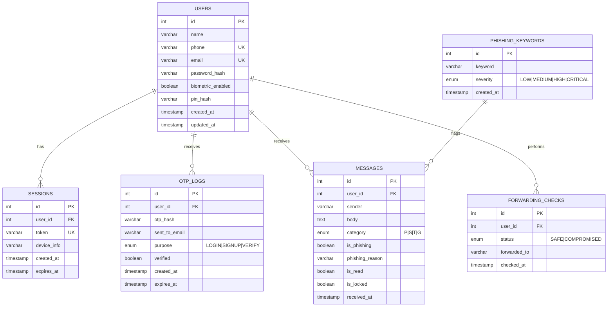

# Database Schema — Privacy Activater

## Entity-Relationship Diagram

---

## Table Details

### `users`

| Column             | Type         | Constraints        | Description                        |
|--------------------|--------------|--------------------|------------------------------------|
| `id`               | INT          | PK, AUTO_INCREMENT | Unique user identifier             |
| `name`             | VARCHAR(100) | NOT NULL           | Full name                          |
| `phone`            | VARCHAR(15)  | UNIQUE, NOT NULL   | Phone number with country code     |
| `email`            | VARCHAR(255) | UNIQUE, NOT NULL   | Email for OTP delivery             |
| `password_hash`    | VARCHAR(255) | NULL               | Optional password (email OTP primary) |
| `biometric_enabled`| BOOLEAN      | DEFAULT false      | Biometric lock preference          |
| `pin_hash`         | VARCHAR(255) | NULL               | Hashed 4-6 digit PIN              |
| `created_at`       | TIMESTAMP    | DEFAULT NOW()      | Registration timestamp             |
| `updated_at`       | TIMESTAMP    | ON UPDATE NOW()    | Last profile update                |

### `sessions`

| Column        | Type         | Constraints        | Description                  |
|---------------|--------------|--------------------|------------------------------ |
| `id`          | INT          | PK, AUTO_INCREMENT | Session identifier            |
| `user_id`     | INT          | FK → users.id      | Owner of the session          |
| `token`       | VARCHAR(512) | UNIQUE, NOT NULL   | JWT or opaque session token   |
| `device_info` | VARCHAR(255) | NULL               | Device fingerprint            |
| `created_at`  | TIMESTAMP    | DEFAULT NOW()      | Session creation              |
| `expires_at`  | TIMESTAMP    | NOT NULL           | Session expiry                |

### `otp_logs`

| Column         | Type         | Constraints        | Description                    |
|----------------|--------------|--------------------|---------------------------------|
| `id`           | INT          | PK, AUTO_INCREMENT | OTP log identifier              |
| `user_id`      | INT          | FK → users.id      | Recipient user                  |
| `otp_hash`     | VARCHAR(255) | NOT NULL           | Hashed OTP (never store plain)  |
| `sent_to_email`| VARCHAR(255) | NOT NULL           | **Email address** (not phone!)  |
| `purpose`      | ENUM         | LOGIN/SIGNUP/VERIFY| Reason for OTP                  |
| `verified`     | BOOLEAN      | DEFAULT false      | Whether the OTP was used        |
| `created_at`   | TIMESTAMP    | DEFAULT NOW()      | When OTP was generated          |
| `expires_at`   | TIMESTAMP    | NOT NULL           | OTP expiry (typically 10 min)   |

> **Security Rule:** OTPs are ALWAYS sent to email, never SMS. The `sent_to_email` column enforces this at the schema level.

### `messages`

| Column           | Type         | Constraints        | Description                          |
|------------------|--------------|--------------------| -------------------------------------|
| `id`             | INT          | PK, AUTO_INCREMENT | Message identifier                   |
| `user_id`        | INT          | FK → users.id      | Device owner                         |
| `sender`         | VARCHAR(50)  | NOT NULL           | Sender ID (e.g., BZ-HDFCBK)         |
| `body`           | TEXT         | NOT NULL           | Full message text                    |
| `category`       | ENUM         | P/S/T/G            | **P**romo/**S**ervice/**T**ransaction/**G**ov |
| `is_phishing`    | BOOLEAN      | DEFAULT false      | Flagged by phishing engine           |
| `phishing_reason`| VARCHAR(255) | NULL               | Why it was flagged                   |
| `is_read`        | BOOLEAN      | DEFAULT false      | Read status                          |
| `is_locked`      | BOOLEAN      | DEFAULT false      | Requires biometric to view           |
| `received_at`    | TIMESTAMP    | DEFAULT NOW()      | When message was intercepted         |

> **Auto-lock Rule:** Messages with `category = 'T'` or `category = 'G'` that contain OTP patterns automatically set `is_locked = true`.

### `forwarding_checks`

| Column         | Type         | Constraints        | Description                       |
|----------------|--------------|--------------------|------------------------------------|
| `id`           | INT          | PK, AUTO_INCREMENT | Check log identifier               |
| `user_id`      | INT          | FK → users.id      | Who performed the check            |
| `status`       | ENUM         | SAFE/COMPROMISED   | Result of USSD inquiry             |
| `forwarded_to` | VARCHAR(15)  | NULL               | Scammer's number (if compromised)  |
| `checked_at`   | TIMESTAMP    | DEFAULT NOW()      | When the check was performed       |

### `phishing_keywords`

| Column     | Type         | Constraints        | Description                        |
|------------|--------------|--------------------|------------------------------------|
| `id`       | INT          | PK, AUTO_INCREMENT | Keyword identifier                 |
| `keyword`  | VARCHAR(100) | NOT NULL           | e.g., "KYC expiring", "click here" |
| `severity` | ENUM         | LOW-CRITICAL       | Threat level                       |
| `created_at`| TIMESTAMP   | DEFAULT NOW()      | When rule was added                |

**Example seed data:** `"KYC expiring"`, `"verify your account"`, `"click this link"`, `"update PAN"`, `"lottery winner"`, `"free gift"`
